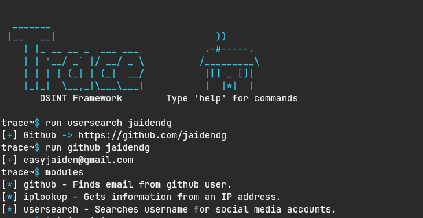

# Trace

Trace is an OSINT framework written in Python.

The goal of Trace is to provide a lightweight, intelligence gathering, and information discovery through a simple command-line interface.

> ⚠️ Trace is currently in early development and should be considered experimental.
> APIs, commands, and module interfaces may change between releases.

## Features

* Sync and async module support
* Dynamic module loading
* Easy module development

## Installation

Clone the repository:

```bash
git clone https://github.com/jaidendg/trace.git
cd trace
```

Create a virtual environment:

```bash
python -m venv venv
```

Activate it:

Linux/macOS:

```bash
source venv/bin/activate
```

Windows:

```powershell
venv\Scripts\activate
```

Install dependencies:

```bash
pip install -r requirements.txt
```

## Usage

Start Trace:

```bash
python trace.py
```

Example:




## Creating Modules

Modules inherit from `BaseModule`.

Example:

```python
from core.base import BaseModule

class ExampleModule(BaseModule):
    name = "example"
    description = "Example module"

    def run(self, target: str):
        return {"result": target}
```

## Roadmap

* More OSINT modules
* Better argument parsing
* Output formatting
* Export results

---